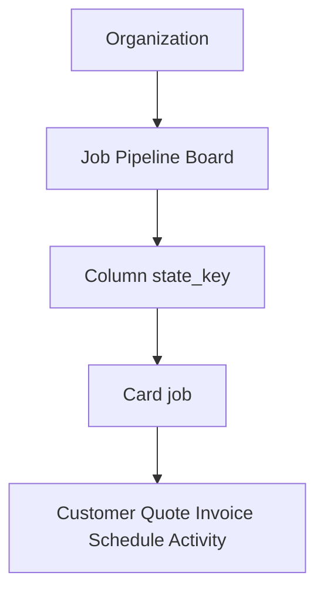

# UI master formula — Ultimate UI for OpsBoard

**Canonical philosophy layer** above implementation specs. For layout and components, see [`WORKSPACE_DESIGN.md`](WORKSPACE_DESIGN.md) and [`CARD_DESIGN.md`](CARD_DESIGN.md). For tokens, see [`DESIGN_TOKENS.md`](DESIGN_TOKENS.md).

---

## 1. Purpose and doc hierarchy

| Layer | Doc | Answers |
|-------|-----|---------|
| Philosophy | **UI_MASTER_FORMULA.md** (this file) | Why the UI feels and behaves this way |
| Workspace | `WORKSPACE_DESIGN.md` | App shell, pipeline, dock, shortcuts |
| Cards | `CARD_DESIGN.md` | Board card + detail panel |
| Tokens | `DESIGN_TOKENS.md` | CSS variables, spacing, motion |

**Change protocol:** Update this formula when changing product-level UI principles. Update `WORKSPACE_DESIGN` / `CARD_DESIGN` when changing layout or components. Never duplicate full specs in `PROGRESS.md` — link here instead.

---

## 2. Core equation

```txt
UI = (Primitive × Hierarchy × Feel) ÷ Noise
```

- **Primitive** — one clear domain graph (org → board → column → card)
- **Hierarchy** — attention flows to the board first
- **Feel** — Field ledger: earthy, utilitarian, trustworthy
- **Noise** — anything that does not help move real jobs to paid

---

## 3. Primitive graph



**Rule:** Every screen must answer *which card, which stage, what's next* in under 2 seconds on the board, or justify why it is not a board context (dashboard, reports, settings).

---

## 4. Attention budget

| Zone | Share | Role |
|------|-------|------|
| Board | 70% | Scan and move work |
| Context bar | 15% | Filters, search, mode |
| Frame | 10% | Sidebar, account |
| Assistant | 5% | AI dock / copilot chip |

Navigation is **frame**, not destination. Login lands on `/pipeline`.

---

## 5. Cognitive modes

| Mode | Surface | Goal | Density |
|------|---------|------|---------|
| **Scan** | Board card | Should I care now? | Signals, badges, ≤3s |
| **Operate** | Card slide-over | Run the job | Full tabs, forms, timeline |

**Rules:**

- Click card → operate (720px panel, board dimmed)
- Drag card → scan (optimistic move, physical metaphor)
- Never blend dense forms into board cards

---

## 6. Lifecycle color theorem

Color encodes **obligation type**, not decoration.

| Category | Accent | Meaning |
|----------|--------|---------|
| Sales | `--cat-sales` (blue) | Sell the job |
| Production | `--cat-production` (green) | Do the work |
| Billing | `--cat-billing` (gold) | Bill and collect |
| Aftercare | `--cat-aftercare` (purple) | Done / archived |

**Semantic only for exceptions:** `--urgent`, `--overdue`, `--paid`, `--draft`.

**Brand green** (`--accent`) is single accent — trust and primary actions.

Board cards: 4px left border + subtle category gradient wash. Not full-card category fill.

---

## 7. Feel: Field ledger

**Do:**

- Warm stone surfaces, forest sidebar, paper-like cards
- DM Sans body, Fraunces display titles, mono for money and state keys
- Honest empty states with one CTA
- Sync status pill (synced / saving · N pending / misaligned + Retry) — see LEARN-018 outbound queue

**Don't:**

- Generic gray SaaS (Inter-only, `#1f2937` nav)
- Stock photo heroes or demo cards in production
- Chart-first home (dashboard is secondary)
- Center-stage AI over the board
- Gratuitous motion on page load

**Feel test:** Would a crew lead trust this on a laptop in a truck at 7am?

---

## 8. Motion constants

| Token | Value | Use |
|-------|-------|-----|
| `--duration-fast` | 120ms | Tab cross-fade |
| `--duration-normal` | 200ms | Dock height, hover |
| `--duration-panel` | 280ms | Panel slide |
| `--ease-panel` | cubic-bezier(0.2, 0.8, 0.2, 1) | Panel open |

**Allowed:** hover lift, drag shadow, drop-target glow, panel slide.

**Forbidden:** bouncy springs, delayed comprehension, decorative page-load animation.

Respect `prefers-reduced-motion: reduce` — disable dock height transition and smooth scroll.

---

## 9. Trust formula

```txt
Trust = RealData + SyncTruth + RoleTruth − MockNoise
```

| Signal | UI |
|--------|-----|
| Real data | Empty pipeline → "Create your first inquiry" |
| Sync truth | `BoardSyncStatusIndicator` on toolbar |
| Role truth | Hide drag/menu/actions for viewers |
| Mock noise | Zero sample jobs in production paths |

See [`NO_MOCK_DATA_POLICY.md`](NO_MOCK_DATA_POLICY.md).

---

## 10. AI adjacency law

```txt
AI = Copilot(context) → Proposal → HumanApproval → DomainWrite
```

| Rule | Detail |
|------|--------|
| Position | Peripheral — bottom dock on pipeline, rail on card panel, floating chip on secondary pages |
| Authority | Human approves medium/high-risk mutations |
| Context | Capped: visible board + open card — never full DB |
| Write path | Tools only — AI never writes Postgres directly |

Morning analyze brief may run while dock is collapsed; bar hint when response ready.

---

## 11. Typography stack

| Role | Font | Use |
|------|------|-----|
| Display | Fraunces (`--font-display`) | Page titles, job titles |
| Sans | DM Sans (`--font-sans`) | UI, body, buttons |
| Mono | system mono stack | Money, dates, state keys |

Three roles only — no fourth display face.

---

## 12. Surface map (implementation)

| Zone | Component | Route / trigger | Attention |
|------|-----------|-----------------|-----------|
| Frame | `Sidebar`, `AppShell` | all `(app)` | 10% |
| Context | `ops-toolbar` | `/pipeline` | 15% |
| Board | `KanbanBoard`, columns | `/pipeline` | 70% |
| Operate | `CardPanel` | `?card=` | overlay |
| Assistant (pipeline) | `AiCommandDock` | `/pipeline` | 5% |
| Assistant (secondary) | `AiPageCopilot` | dashboard, calendar, etc. | 5% |
| Assistant (card) | `AiRail` / `AiDock` compact | panel right rail | nested |

**Code anchors:** `components/workspace/`, `components/pipeline/KanbanBoard.tsx`, `components/card/CardPanel.tsx`, `components/ai/AiCommandDock.tsx`, `app/globals.css`.

---

## 13. Acceptance tests

| ID | Pass when |
|----|-----------|
| AC-1 | Login lands on `/pipeline` |
| AC-2 | Collapsed AI dock visible (48px) with placeholder |
| AC-3 | Dock expands ~220px; toolbar filters still visible |
| AC-4 | Full pipeline: group jump chips scroll to groups |
| AC-5 | Topo pattern subtle on board |
| AC-6 | `` ` ``, `/`, `?` shortcuts work on pipeline |
| AC-7 | Card panel open → dock uses card context/chips |
| AC-8 | Empty board: illustration + CTA, no mock cards |
| AC-9 | Brand mark in sidebar + favicon |
| AC-10 | This doc linked from DOC_INDEX and AGENTS |
| AC-11 | css-health + unit tests green |
| AC-12 | PROGRESS + DEVELOPMENT_LOG updated after alignment work |

E2E IDs: `E2E-WORKSPACE-001` … `E2E-WORKSPACE-005`, `CSS-002`.

---

## 14. Known deltas (intentional deferrals)

| Item | Status | Notes |
|------|--------|-------|
| Pipeline mini-map | Post-MVP | WORKSPACE_DESIGN §4 |
| Collapsible column groups | Post-MVP | Vertical labels only today |
| `og.png` marketing | Deferred | Brand folder |
| Notifications bell + pending API | Phase B | Inline approval during AI actions works |
| Skip-to-content link | Deferred | a11y enhancement |
| Bottom dock on secondary pages | By design | `AiPageCopilot` floating chip |

---

## 15. One-sentence summary

> Show work moving through stages on a surface that feels like a real job board; open any job into a full ticket when it's time to act; keep everything else quiet, honest, and out of the way.
